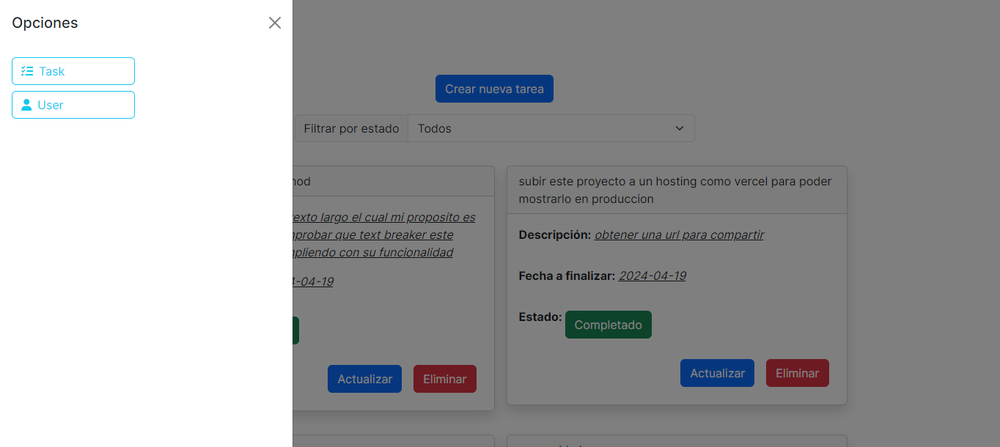
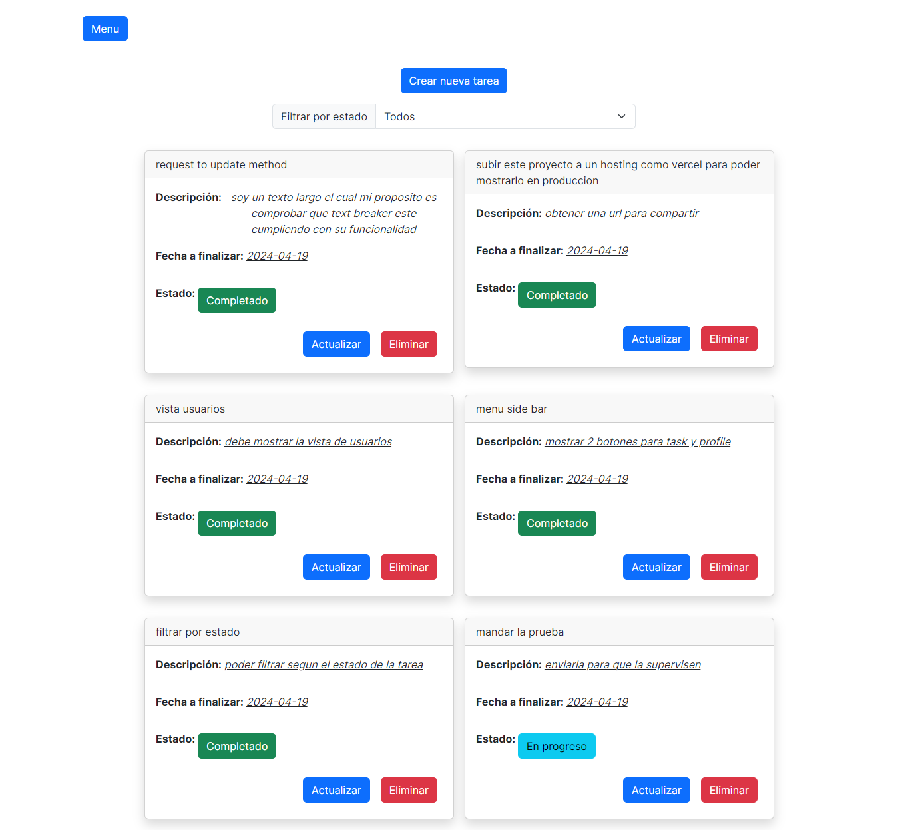
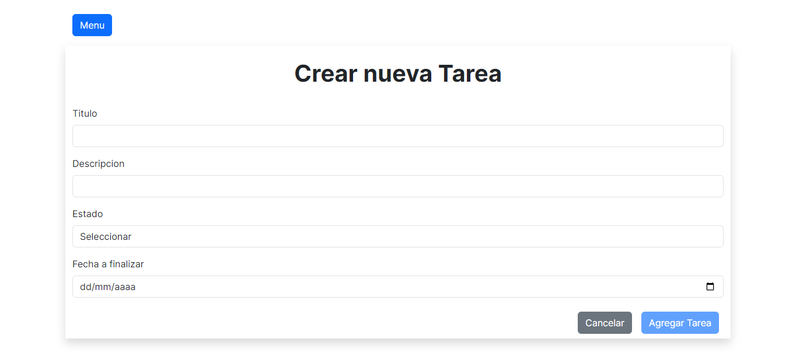
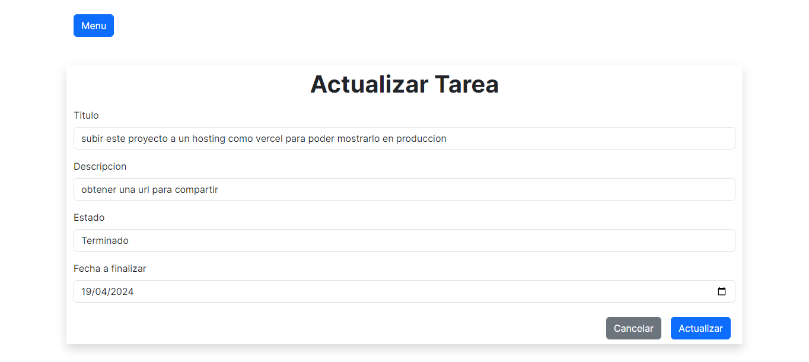
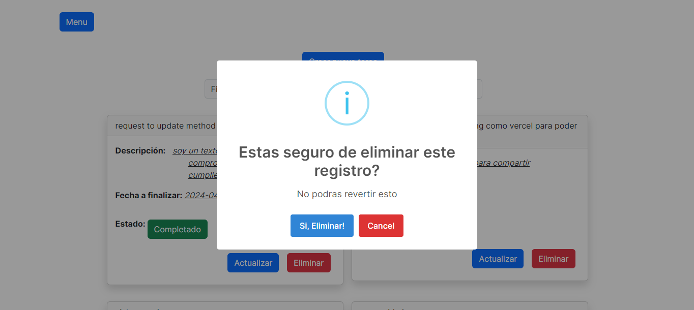
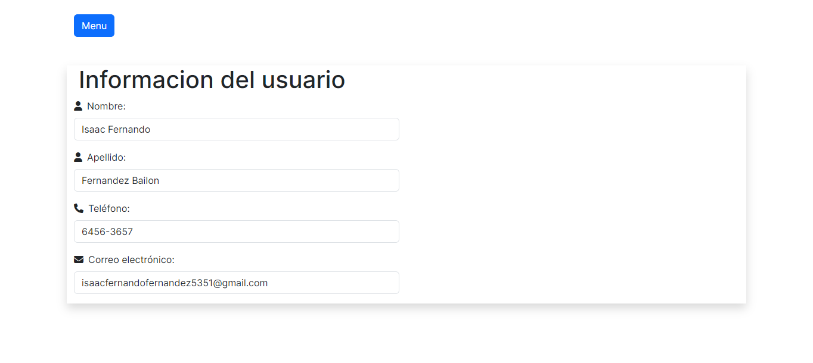

## Project Repository

### Instructions for Running the Project
To run the project, navigate to the root folder and execute the following commands:

```bash
npm install
npm run dev


### Project Description
The project is a todo list application where users can create, edit, retrieve, and delete tasks. It provides functionality to filter tasks based on their status.

### Screenshot







### Stack Description
The technology stack used for the development of this project includes:

- **TypeScript (TSX)**: TypeScript was chosen for its ability to provide type safety and ensure data validation.
  
- **Next.js**: Next.js was selected to handle routing efficiently, as it offers folder-based routing out of the box.

- **Font Awesome**: Font Awesome was used as the icon source, providing a wide range of icons to enhance the user interface.

- **Bootstrap**: Bootstrap was employed as the CSS framework to streamline the styling process and ensure a responsive design.

- **SweetAlert**: SweetAlert was integrated to display user-friendly alerts for various actions, enhancing the overall user experience.

These technologies were chosen for their robust features, ease of use, and compatibility with the project requirements, ultimately contributing to the development of a functional and visually appealing todo list application.
